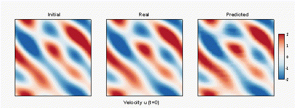
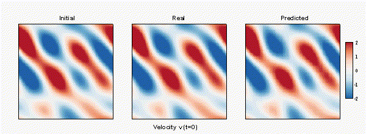

# Implementation of  the local neural operator

This page releases codes and data of an academic paper, 'Local neural operator for solving transient partial differential equations on varied domains'.
With the provided codes, one can quickly reproduce the training and validation of local neural operator.
Also, two demos for applying the well-trained LNOs to respectively solve the 2-D flows around a square and the NACA0012 airfoils are provided.

We just consider the networks and applications provided here as examples.
And we believe that, with the local learning framework, more sophisticated architectures or interesting applications could come out soon for learning various partial differential equations.
In Chinese, we consider all the demos here for '抛砖引玉', which means we are showing some crude bricks out for inspiring much more brilliant ideas (the gems) from any other.

## Environment

Pytorch 1.7.1

## Data

We provide full testing data for learning the Navier-Stokes equations (mu = 0.002), and a single sample for training (including the velocity fields of 8s).

To reproduce the reported results, please download the provided data from

URL: https://pan.baidu.com/s/1-XdFSOX4MTY1baRWpgSKHw 

code: lb27 

Unzip the data files at ```/Train_Validation/Data/*```

## Training and Validation

The Python script main.py does both the network training and validation.
Please change the function inside the script

Train and validate a new network named 'newLNO'
```
python main.py -n newLNO
```

Validated the trained network provided in models/
'''
python main.py -n NS_200ep_LNO-legendre2_n16m8k2
'''

## Applications

Apply the trained LNO to solve the 2-D flow around a square

```
python mainSquareCylinder.py
```

Apply the trained LNO to solve the 2-D flow across a cascade airfoil

```
python mainCascade.py
```

## GIF Demos

Validation: flow in 2-D square domain with periodical boundaries (mu=0.002)

 
 
 
 
Application 1: 2-D flow around a square

 

Application 2: 2-D flow across a cascade airfoil

 

## Paper and citation 

This paper is now published as a preprint on arXiv.org.
Full text can be downloaded at https://doi.org/10.48550/arXiv.2203.08145.

Please cite this paper if any part of the codes here is used in your research. Great thanks to you!
